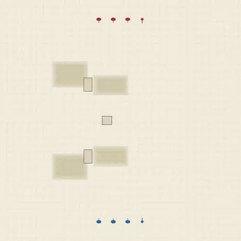
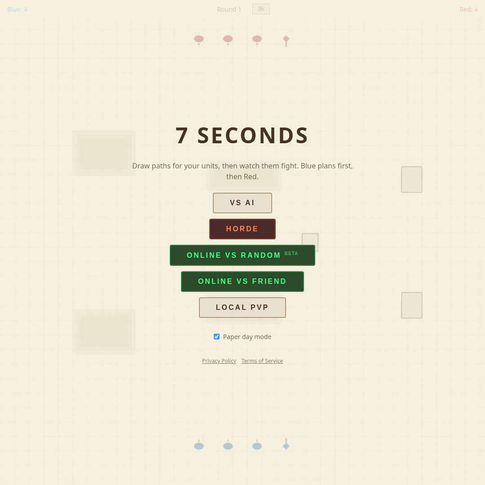
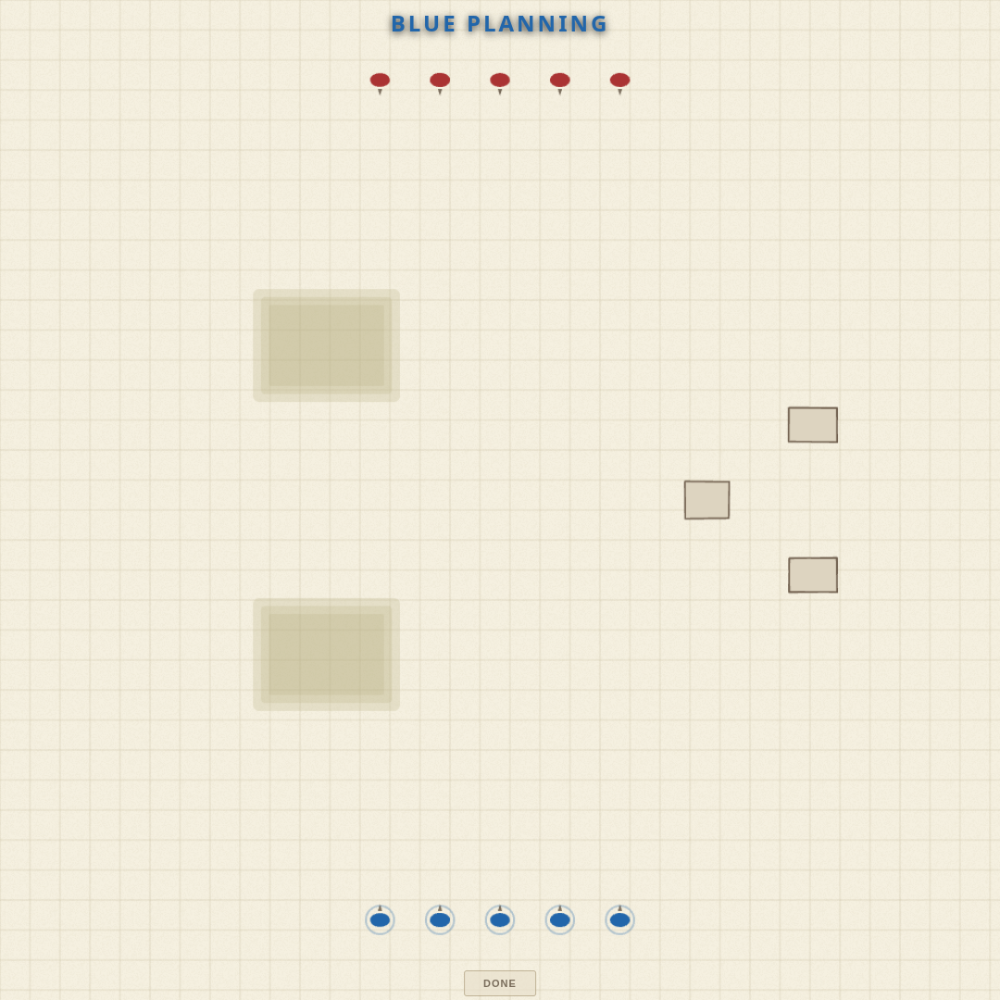
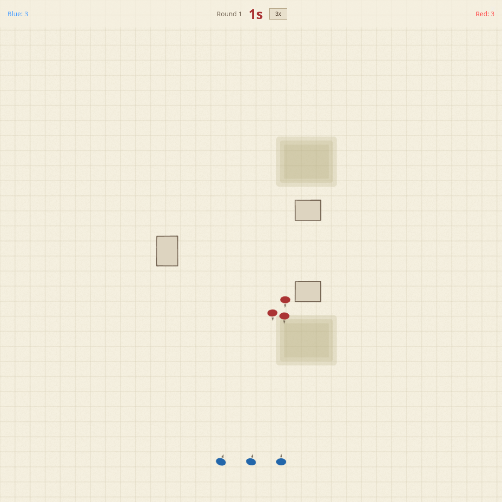
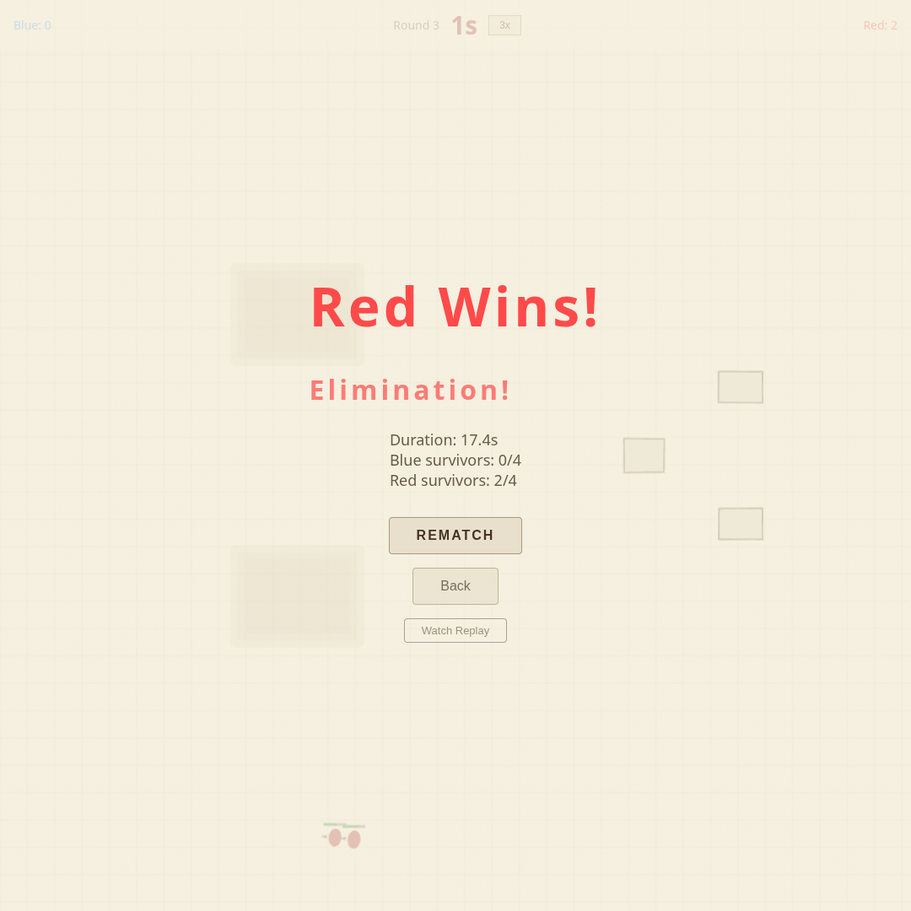
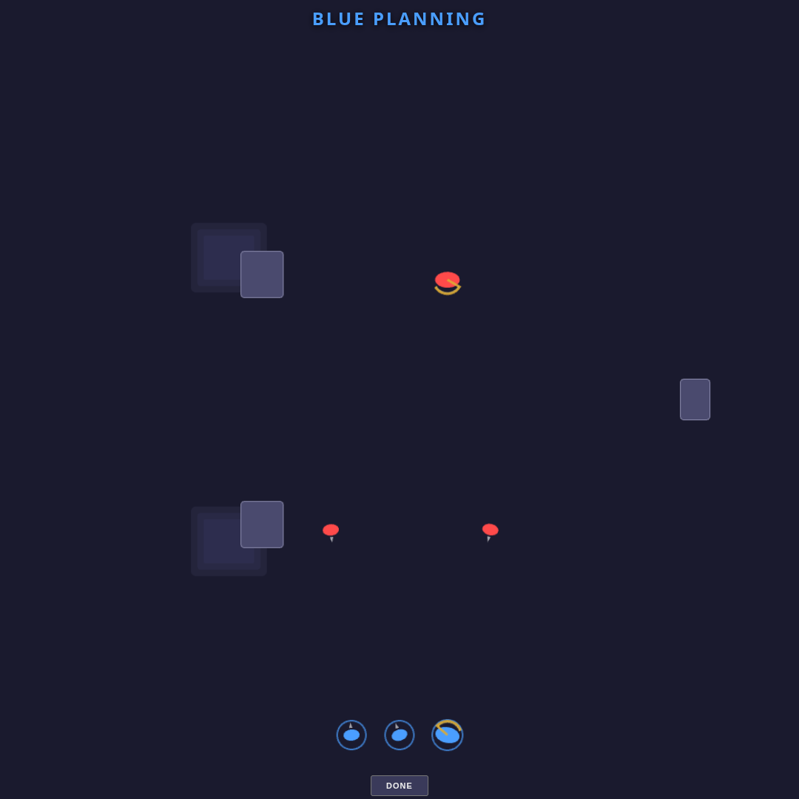
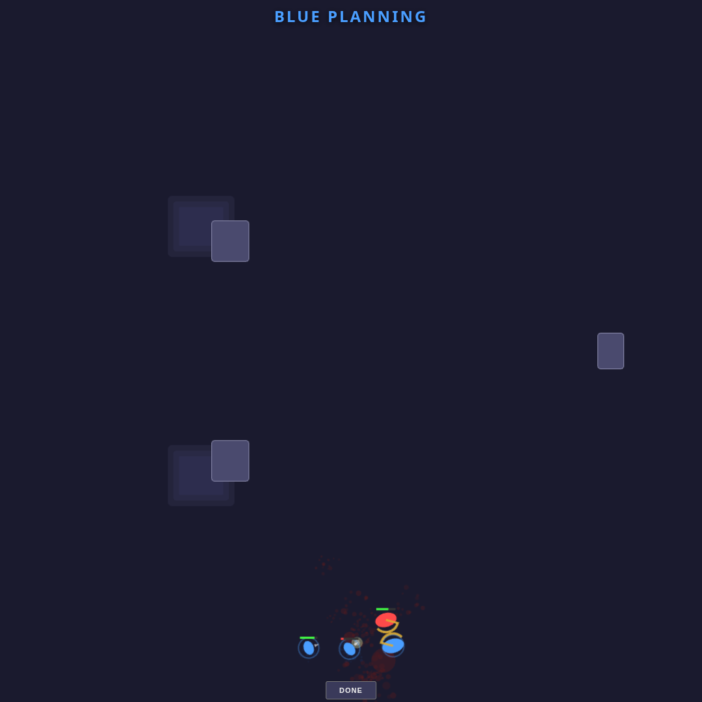

<p align="center">
  
</p>

<h1 align="center">7 Seconds</h1>

<p align="center">A tactical micro-strategy game. Draw paths for your units, then watch them fight.</p>

<p align="center">
  
</p>

## How It Works

1. **Plan** — Draw movement paths for each of your units
2. **Fight** — Units follow their paths and auto-engage enemies within range
3. **Repeat** — Survive multiple rounds until one side is eliminated

Terrain matters: elevation grants range bonuses, obstacles block movement and line of sight, and flanking deals extra damage.

## Game Modes

- **vs AI** — Single player against AI opponents
- **Horde** — Survive 10 waves of increasingly difficult enemies, choosing upgrades between waves
- **Online vs Random** — Matchmake against a random opponent via Supabase Realtime
- **Online vs Friend** — Share a link and play against a friend
- **Local PvP** — Hot-seat multiplayer on the same device

## Unit Types

| Unit | Role |
|------|------|
| Soldier | Balanced all-rounder |
| Sniper | Long range, slow, fragile |
| Blade | Fast melee attacker |
| Shielder | Tanky frontline |
| Bomber | Area damage |

## Screenshots

| Menu | Planning | Battle | Result |
|------|----------|--------|--------|
|  |  |  |  |

<details>
<summary>Night mode</summary>

| Planning | Battle |
|----------|--------|
|  |  |

</details>

## Tech Stack

- **Renderer**: [PixiJS](https://pixijs.com/) 8 (WebGL)
- **Online**: [Supabase](https://supabase.com/) Realtime (WebRTC peer-to-peer with relay fallback)
- **Mobile**: [Capacitor](https://capacitorjs.com/) (Android)
- **Build**: [Vite](https://vite.dev/) + TypeScript (strict)
- **Tests**: [Vitest](https://vitest.dev/)

Zero runtime CSS frameworks. Two themes (paper day mode, dark night mode) via CSS custom properties.

## Development

```bash
npm install
npm run dev        # start dev server
npm run build      # production build
npm run test:run   # run tests
```

## Recording

Append `?record` to the URL to enable the built-in screen recorder. Press **R** during battle or replay to capture a WebM clip (max 15 seconds).

Run `npm run video:capture` to regenerate the square and 9:16 mobile action clips in `store-assets/`. The Playwright-driven capture includes path drawing before the battle and requires `ffmpeg`/`ffprobe`.
